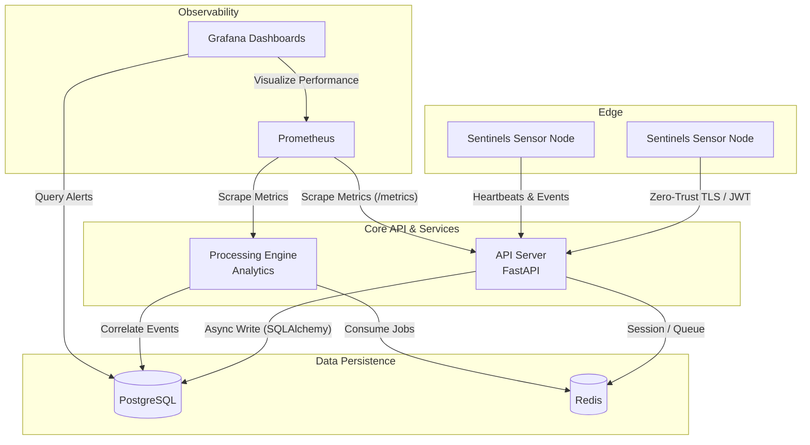

# Sentinels: Advanced Deception Technology Platform

 
**Sentinels** is a modern, distributed, multi-protocol network honeypot and threat intelligence platform. Built for scale and low latency, its primary use-case is to catch malicious actors *after* they've breached non-public networks by deploying deceptive assets and services.

[](https://www.python.org/downloads/)
[](https://fastapi.tiangolo.com/)
[](https://www.postgresql.org/)
[](https://www.docker.com/)

---

## 🚀 Tech Stack

This project was engineered to demonstrate a production-ready microservices architecture utilizing modern Python paradigms:
* **Backend Framework:** FastAPI (Asynchronous, High-Performance)
* **Database & ORM:** PostgreSQL 15, SQLAlchemy 2.0 (Async/Await), Alembic (Migrations)
* **Caching & Queueing:** Redis 7
* **Data Validation:** Pydantic V2
* **Observability:** Prometheus (Metrics), Grafana (Dashboards), OpenTelemetry
* **Infrastructure:** Docker & Docker Compose

---

## 🏗 System Architecture & Data Flow

Sentinels employs a distributed architecture designed for scale, resilience, and real-time observability. 



---

## 📂 Repository Structure

```text
sentinels/
├── apps/
│   ├── api-server/             # Core FastAPI Backend
│   │   ├── main.py             # App entrypoint & API Routes
│   │   ├── models.py           # SQLAlchemy 2.0 DB Models (Tenant, Event, Sensor)
│   │   ├── schemas.py          # Pydantic validation schemas
│   │   ├── database.py         # Asyncpg engine configuration
│   │   ├── auth.py             # Authentication module
│   │   ├── alembic/            # Database schema migrations
│   │   ├── Dockerfile          # Containerization for API server
│   │   └── requirements.txt    # Microservice dependencies
│   └── processing-engine/      # Background Analytics & Threat Intel Engine
│       ├── analytics.py        
│       └── requirements.txt
├── infra/                      # Infrastructure as Code & Observability
│   ├── docker-compose.yml      # Multi-container orchestration
│   ├── prometheus/             # Time-series metrics scraping config
│   └── grafana/                # Pre-built monitoring dashboards
├── libs/                       # Shared Libraries & Modules
│   ├── sdk/                    # Sentinels SDK
│   └── threat-intel/           # Threat Intelligence Providers
│       ├── provider_base.py    # Base interface for providers
│       └── providers.py        # Specific threat intel providers
├── plugins/                    # Extensible honeypot protocol modules (SSH, HTTP, SMB)
├── tools/                      # CLI utilities & setup scripts
│   └── sentinels-cli/          # Command Line Interface tool
│       └── main.py
├── start.sh                    # Helper script to start services
├── CONTAINERIZATION_SUMMARY.txt # Summary of containerization details
├── DOCKER_BEST_PRACTICES.md    # Docker best practices guide
└── README.md
```

---

## ✨ Key Enterprise Features

This repository includes advanced enterprise-grade additions that push it to the bleeding edge of deception technology:

* **Zero-Trust Sensor Registration:** Edge sensors must authenticate via provisioned tokens before pushing events or receiving deception assets.
* **Automated Noise Filtering:** A built-in time-series correlation engine that suppresses alert fatigue by filtering out known internet scanners.
* **Threat Intelligence Auto-Scoring:** Real-time IP extraction and Threat Intel scoring automatically appended to JSON logs.
* **Database Optimization:** Fully asynchronous database transactions with indexed foreign keys and strict Pydantic payload validation.
* **CanaryTokens Engine:** A utility to automatically drop fake AWS credentials and tracking documents into SMB/FTP shares.

---

## 🛠 Quick Start (Docker)

The fastest way to evaluate the architecture is via the pre-configured `docker-compose` environment, which spins up the database, cache, API server, and observability stack.

```bash
# 1. Clone the repository
git clone https://github.com/TathagataSen06/Sentinels.git
cd Sentinels

# 2. Start the infrastructure
cd infra
docker compose up -d

# 3. Verify the services
docker compose ps
```

Once running, you can access:
* **API Documentation (Swagger UI):** `http://localhost:8000/docs`
* **Grafana Dashboards:** `http://localhost:3000` (Login: `admin` / `admin`)
* **Prometheus Metrics:** `http://localhost:9090`

---

## 💻 Local Development (API Server)

If you wish to run the API server locally for development:

```bash
cd apps/api-server

# Create virtual environment and install requirements
python -m venv env
source env/bin/activate  # On Windows: env\Scripts\activate
pip install -r requirements.txt

# Start the FastAPI server (Requires PostgreSQL on localhost:5432)
uvicorn main:app --reload
```
